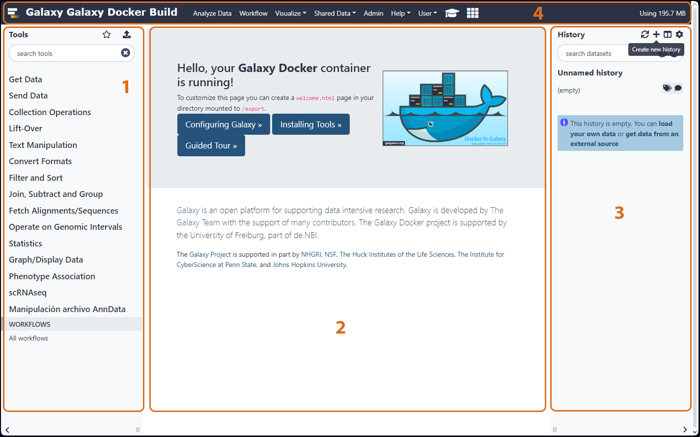

# Análisis de secuenciación de célula única con Galaxy

# Aspectos generales de Galaxy

Para acceder a la plataforma de Galaxy de LatinCells ingrese al siguiente enlace:

[https://galaxy.latincells.integrativebioinformatics.me](https://galaxy.latincells.integrativebioinformatics.me) 

En la pantalla de inicio se pueden observar 5 secciones, a la izquierda se encuentra la barra de herramientas, en donde puede buscar y encontrar las herramientas que necesite ocupar en sus análisis (1). Al centro se encuentra la pantalla de inicio, esta es la pantalla principal y aquí se mostrará lo que el usuario esté trabajando (2). A la izquierda se encuentra la barra de historial, aquí encontrará los archivos de entrada, de salida, e intermedios que sean obtenidos en sus análisis (3). Finalmente, en la parte superior se encuentra la barra del menú superior, en la cual podemos navegar dentro de las diferentes secciones de Galaxy, como los Flujos de Trabajo o diferentes Historiales (4).

