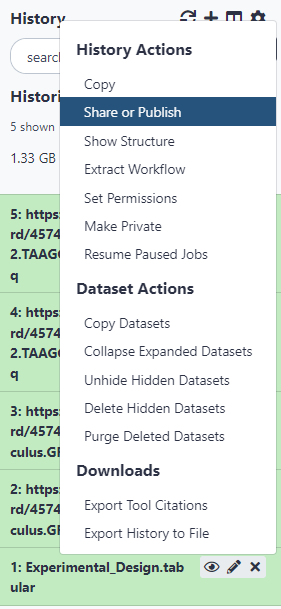
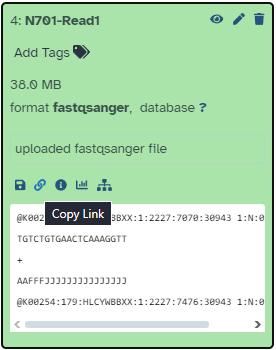
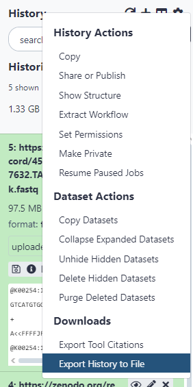

## Importar historial

En primer lugar, podemos importar los historiales que fueron hechos para trabajar directamente con este tutorial (para la **Parte 2**):

* Ingresar cualquiera de los siguientes enlaces:
    * [https://usegalaxy.eu/u/j.jakiela/h/combining-datasets-input](https://usegalaxy.eu/u/j.jakiela/h/combining-datasets-input)
    * [https://usegalaxy.org/u/juliajot/h/combining-datasets-input](https://usegalaxy.org/u/juliajot/h/combining-datasets-input)
* Seleccionar “Import this history”
* Ingrese un título para el nuevo historial
* Seleccionar “Copy History”

Alternativamente, es posible importar el historial a otro servidor de Galaxy:

* Transferir un solo archivo:
    * En el servidor de Galaxy donde se encuentra originalmente el archivo, debe **configurar el historial a un estado compartido**.
        * Para cambiar esta configuración, debe presionar el ícono de opciones del historial y seleccionar “Share or Publish”, marcar “Also make all objects within the History accessible” y seleccionar “Make History Accessible via Link” (estos pasos pueden variar dependiendo del servidor de Galaxy en el que se encuentre)

        * En el caso del servidor de Galaxy de LatinCells, obtendrá un link para compartir el historial en la misma ventana indicada en el paso anterior.
        * En otros servidores de Galaxy, en los archivos del historial aparecerá un ícono de enlace en la barra de íconos inferior de los archivos, como se indica en la siguiente imagen. Al presionar este ícono, se copiará automáticamente el enlace de descarga para el archivo seleccionado.

* Transferir el historial completo:
    * Para hacer esto, debe tener una cuenta de Galaxy en cada uno de los servidores que esté utilizando (no aplica al servidor de Galaxy LatinCells ya que en el paso anterior ya se generó el enlace para descargarlo).
    * En el servidor de Galaxy que contiene los archivos que desea copiar:
        * Configurar el historial a un estado compartido.
        * En las opciones del historial, seleccionar “Export History to File”

        * En la nueva ventana se consulta cómo desea exportar el historial, debe seleccionar “to direct download”.
        * Seleccionar “Generate direct download”.
        *  Se iniciará una animación de carga, cuando esta termine, copie el enlace del archivo. *
    * En el servidor de Galaxy de destino de los archivos:
        * En servidor de Galaxy LatinCells: Seleccionar “User/Histories” en el menú superior, y presionar “Import from file”.
        * En otros servidores de Galaxy: Seleccionar “Users/Datasets” o “Data/Datasets”, dependiendo del servidor de Galaxy en el que se encuentre, y seleccionar “Saved Histories”.
        * Seleccionar “Import history” en el botón gris en la esquina superior derecha.
        * Pegar el enlace previamente obtenido.
        * Seleccionar “Import History”
        * Luego de que la pantalla de carga muestre que el proceso ha finalizado, el historial se encontrará en “Saved Histories”. *
    * * En estos pasos puede dejar que el servidor trabaje sólo, y si tiene las notificaciones por correo electrónico activadas, le llegará una notificación cuando el proceso haya terminado.
